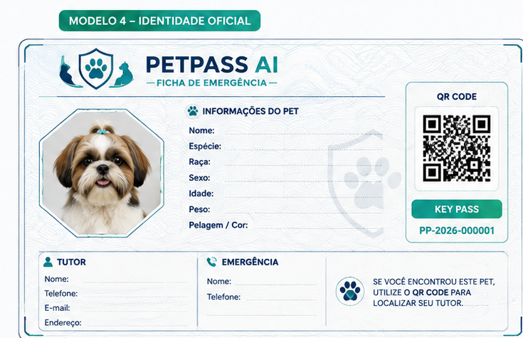

# PetPass AI

**Protótipo experimental de cadastro e ficha de emergência para animais de estimação, com organização das informações por IA generativa.**

O PetPass AI nasceu como um protótipo desktop desenvolvido para portfólio e evoluiu para um projeto de engenharia documentada. Hoje, o repositório reúne software experimental executável, integração com a OpenAI e uma arquitetura-alvo definida para futura reimplementação controlada.



## Estado atual

| Estado | Escopo verificado |
|---|---|
| **Protótipo implementado** | Aplicação Python/PySide6 com cadastro, validações, ficha simplificada e resumo por IA. |
| **Documentação concluída** | Engenharia de Produto concluída e Engenharia Técnica documentada e congelada. |
| **Arquitetura-alvo definida** | Cinco camadas, componentes, modelos de dados, fluxos e tecnologias definidos documentalmente. |
| **Não implementado** | Arquitetura de cinco camadas, n8n, SQLite, HTTP/JSON entre camadas, Key Pass, QR Code e testes automatizados. |
| **Planejado** | Reimplementação incremental conforme o plano técnico e mediante a governança do projeto. |

A transição para a reimplementação está em preparação controlada. A implementação da arquitetura congelada ainda não foi iniciada. A **Baseline 1.0 está documentalmente pronta, com publicação formal pendente**.

## Problema do projeto

Informações importantes sobre um pet — identificação, tutor, contato e dados médicos declarados — podem estar dispersas ou indisponíveis em uma situação de emergência. O PetPass AI investiga uma forma de reuni-las em uma ficha clara, rastreável e de consulta prática.

O objetivo de produto documentado é manter um cadastro oficial como fonte das informações e, no futuro, associá-lo a uma identidade digital denominada **Key Pass**, representada graficamente por QR Code.

## Protótipo experimental

O código atual é anterior à arquitetura-alvo e permanece preservado como evidência experimental. Ele permite demonstrar o fluxo principal da ideia sem representar a implementação oficial da Baseline 1.0.

Este diretório contém o **protótipo experimental pré-Baseline 1.0**. A arquitetura definida pela Baseline 1.0 não está implementada nesses arquivos.

Artefatos do protótipo:

- [Aplicação PySide6](prototype/experimental/main.py)
- [Integração com a OpenAI](prototype/experimental/openai_service.py)
- [Dependências do protótipo](prototype/experimental/requirements.txt)

O protótipo:

- executa como aplicação desktop em Python com PySide6;
- coleta dados do pet, tutor e informações médicas declaradas;
- aplica validações básicas de cadastro;
- apresenta uma ficha de emergência simplificada;
- solicita à OpenAI um resumo organizado dos dados preenchidos;
- mantém os dados somente em memória durante a execução.

## O que funciona hoje

- abertura da aplicação e da janela de novo cadastro;
- campos de identificação do pet;
- seção de tutor e contato de emergência;
- seção de informações médicas declaradas;
- seleção e validação básica de arquivo de imagem;
- validação de nome, espécie, raça, idade e peso;
- bloqueio do cadastro quando campos obrigatórios ou valores validados são inválidos;
- exibição simplificada da Ficha de Emergência;
- geração opcional de Resumo Inteligente pela API da OpenAI;
- mensagens para configuração ausente ou falha na chamada da API.

O botão de salvar não grava informações em arquivo ou banco de dados. O estado permanece apenas na memória do processo.

## Papel e limites da IA

A IA atua exclusivamente na organização textual das informações fornecidas pelo usuário na ficha. A integração envia somente campos preenchidos e solicita um resumo claro e organizado.

Os limites implementados no prompt proíbem a IA de:

- inventar dados do pet;
- produzir diagnósticos;
- prescrever medicamentos;
- indicar tratamentos;
- criar recomendações médicas não fornecidas.

A IA não substitui atendimento veterinário nem decide regras de cadastro. Quando a configuração da OpenAI está ausente ou a chamada falha, o protótipo informa o problema ao usuário.

## Como executar o protótipo

### Pré-requisitos

- Python com suporte às dependências declaradas no projeto;
- credencial própria da API da OpenAI para usar o Resumo Inteligente.

### Instalação

Na raiz do repositório:

```bash
python -m pip install -r prototype/experimental/requirements.txt
```

### Configuração da IA

O código lê duas variáveis de ambiente:

- `OPENAI_API_KEY`: chave da API da OpenAI;
- `OPENAI_MODEL`: identificador do modelo disponível na conta utilizada.

Exemplo no PowerShell, substituindo os valores localmente:

```powershell
$env:OPENAI_API_KEY="sua-chave-local"
$env:OPENAI_MODEL="seu-modelo"
python prototype/experimental/main.py
```

Não registre chaves de API no código, no README ou no controle de versão. Sem essas variáveis, as telas de cadastro e ficha continuam disponíveis, mas a geração do resumo informa que a IA não está configurada.

## Limitações atuais

- dados não persistem após encerrar a aplicação;
- Key Pass não implementada;
- geração e regeneração de QR Code não implementadas;
- coordenação por n8n não implementada;
- banco SQLite não implementado;
- comunicação HTTP/JSON entre camadas não implementada;
- arquitetura de cinco camadas ainda não materializada em código;
- layout do protótipo não corresponde integralmente ao modelo visual aprovado;
- acionamento do contato telefônico não implementado;
- suíte de testes automatizados não implementada;
- não há empacotamento, publicação ou implantação do aplicativo.

## Arquitetura-alvo

A Engenharia Técnica define cinco camadas com responsabilidades separadas:

1. **Apresentação e Interação Institucional** — recebe ações do usuário e apresenta resultados.
2. **Coordenação de Aplicação** — coordena os fluxos sem assumir regras de domínio.
3. **Domínio e Regras do PetPass AI** — aplica as regras documentadas do produto.
4. **Registro Oficial de Informações** — mantém o estado oficial dos cadastros e vínculos.
5. **Limite com o Ambiente de Utilização** — entrega ações aos recursos externos disponíveis.

Essa arquitetura está definida, mas não implementada. A apresentação não deverá acessar diretamente o Domínio ou o Registro Oficial, e o n8n deverá permanecer restrito à coordenação dos fluxos.

Documentos principais:

- [Arquitetura Conceitual](docs/engineering/technical/ET-AR-001_ARQUITETURA_CONCEITUAL_PETPASS_AI.md)
- [Complementação da Arquitetura Tecnológica](docs/engineering/technical/ET-AR-003_COMPLEMENTACAO_ARQUITETURA_TECNOLOGICA.md)
- [Componentes Técnicos](docs/engineering/technical/ET-CP-001_COMPONENTES_TECNICOS_PETPASS_AI.md)
- [Modelo Lógico de Dados](docs/engineering/technical/ET-DD-002_MODELO_LOGICO_DADOS_PETPASS_AI.md)
- [Fluxos Técnicos](docs/engineering/technical/ET-IF-001_FLUXOS_TECNICOS_PETPASS_AI.md)

## Engenharia e rastreabilidade

O projeto separa explicitamente especificação, decisão tecnológica e implementação. O corpus documental inclui:

- requisitos e funcionalidades do MVP;
- deliberações do Product Owner;
- parâmetros de cadastro e ficha;
- arquitetura conceitual e tecnológica;
- 17 componentes técnicos;
- oito entidades e 13 relacionamentos lógicos;
- seis fluxos técnicos;
- tratamento de exceções e revisão de prontidão;
- auditorias de lacunas e proficiência documental;
- plano de implementação e governança da arquitetura.

Referências primárias:

- [Especificação Funcional do MVP](docs/engineering/product/GP-PP-09C_ESPECIFICACAO_FUNCIONAL_MVP.md)
- [Matriz de Rastreabilidade dos Requisitos](docs/engineering/product/GP-PP-09B_MATRIZ_RASTREABILIDADE_REQUISITOS_MVP.md)
- [Auditoria de Proficiência da Engenharia](docs/audits/GP-ENG-001_AUDITORIA_PROFICIENCIA_ENGENHARIA_PETPASS_AI.md)
- [Baseline 1.0](docs/governance/EP-002_BASELINE_1_0_PETPASS_AI.md)

A Baseline 1.0 consolida 38 artefatos documentais e visuais. Seu manifesto registra prontidão documental, mas condiciona a publicação formal à aprovação, à organização física dos artefatos e ao registro versionado. Portanto, a **Baseline 1.0 está documentalmente pronta, com publicação formal pendente**; esse estado não autoriza implementação.

## Relação com o ICFACTORY

O CASE-03 registra a aplicação experimental do ICFACTORY ao PetPass AI. Essa relação fornece evidências específicas deste projeto sobre:

- rastreabilidade de decisões;
- separação entre Engenharia de Produto, Engenharia Técnica e Implementação;
- tratamento explícito de lacunas;
- congelamento de baselines antes da implementação;
- preservação de responsabilidades arquiteturais;
- não promoção automática de resultados experimentais.

As conclusões permanecem limitadas ao CASE-03 e não constituem validação geral ou promoção normativa do método. O Product Owner conserva a autoridade final sobre prioridades, aprovações, publicação da baseline e abertura da implementação.

Referências:

- [Plano de Governança Experimental](docs/governance/DO-CASE03-001_PLANO_GOVERNANCA_EXPERIMENTAL_PETPASS_AI.md)
- [Lições Aprendidas](docs/knowledge/GP-ICF-001_LICOES_APRENDIDAS_CASE03.md)
- [Relatório de Encerramento Metodológico](docs/knowledge/GP-ICF-002_RELATORIO_ENCERRAMENTO_METODOLOGICO_CASE03.md)

## Roadmap

### Concluído documentalmente

- Engenharia de Produto;
- arquitetura conceitual e tecnológica;
- componentes e modelos de dados;
- fluxos técnicos FT-01 a FT-06;
- tratamento técnico das exceções do primeiro workflow;
- congelamento da Arquitetura Técnica;
- consolidação documental da Baseline 1.0.

### Próximas entregas planejadas

1. **Cadastro Oficial** — cadastro válido e bloqueio por falha de validação.
2. **Identidade Digital** — constituição da Key Pass e representação por QR Code.
3. **Representação Institucional** — Ficha de Emergência baseada no cadastro oficial.
4. **Contato de Emergência** — entrega da ação de contato ao ambiente de utilização.

A ordem do roadmap não autoriza automaticamente o início das entregas. A execução depende das condições e decisões previstas pela governança do projeto.

## Contexto DIO

O protótipo foi desenvolvido no contexto de um desafio de IA Generativa da DIO. Para portfólio, ele demonstra:

- aplicação desktop com Python e PySide6;
- integração real com a API da OpenAI;
- definição de limites para conteúdo gerado por IA;
- validação de entradas e tratamento de erros;
- evolução de um protótipo para uma engenharia rastreável;
- distinção entre software demonstrável, arquitetura definida e trabalho futuro.

## Tecnologias por estado

### Implementadas no protótipo experimental

| Tecnologia | Uso atual |
|---|---|
| Python | Lógica da aplicação e ponto de entrada. |
| PySide6 | Interface desktop, formulários, validações e ficha simplificada. |
| SDK da OpenAI | Comunicação com a Responses API para gerar o resumo. |

### Definidas, mas não implementadas na arquitetura-alvo

| Tecnologia | Responsabilidade planejada |
|---|---|
| Python com PySide6 | Apresentação institucional. |
| n8n | Coordenação e orquestração dos fluxos técnicos. |
| Python | Domínio e regras do produto. |
| SQLite com acesso encapsulado em Python | Registro oficial das informações. |
| HTTP com JSON | Integração entre as camadas participantes do primeiro workflow. |

A tecnologia da quinta camada, relacionada ao ambiente de utilização, permanece não determinada para a fase de contato de emergência.

## Autor, licença e status

**Henderson Mauricio Batista**  
Fundador e Product Owner do PetPass AI.

- **Status do protótipo:** experimental e demonstrável localmente.
- **Status da engenharia:** documentalmente proficiente, com arquitetura técnica congelada.
- **Status da implementação oficial:** não iniciada.
- **Status da Baseline 1.0:** documentalmente pronta, com publicação formal pendente.
- **Licença:** ainda não definida. Até sua definição, nenhum direito de uso, modificação ou redistribuição é concedido implicitamente.
